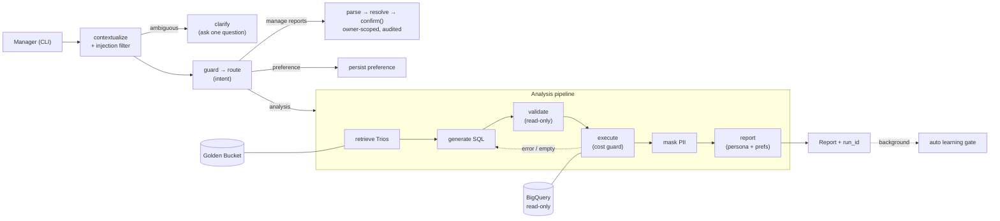

# Data Analysis Chat Assistant

A conversational agent that lets non-technical retail managers ask business questions in plain English —
*"Which product categories drove the most revenue last quarter?"* — and get **analyst-grade reports**
grounded in real query results over **BigQuery** (`bigquery-public-data.thelook_ecommerce`).

It generates and runs **validated, read-only SQL**, masks customer PII before any data reaches the model,
self-corrects on errors, requires confirmation before destructive actions, learns from good answers, and
is fully observable — all from a simple CLI. Built on **LangGraph + LangChain Core** with **Google Gemini**.

> **Documentation:** **[docs/HLD.md](docs/HLD.md)** — the detailed technical explanation (covers all 8
> requirements) · **[docs/architecture.md](docs/architecture.md)** — architecture diagrams + service
> rationale.

---

## What it can do (30 seconds)

- **Hybrid intelligence** — retrieves analyst "Trios" (Question → SQL → Report) from a **Golden Bucket**
  and uses them as few-shot exemplars, so it interprets questions the way analysts do, not just from a schema.
- **Conversational** — resolves follow-ups ("now break that down by category", "compare it to last year"),
  asks a clarifying question when ambiguous instead of guessing, and decomposes compound questions.
- **Safe** — read-only SQL (validated), **PII masked before the model ever sees a row**, malicious/off-topic
  input refused, destructive deletes gated behind a confirmation.
- **Resilient** — bounded SQL self-correction, retries + circuit breaker over Gemini *and* BigQuery, a
  dry-run cost guard, and a CLI that never crashes.
- **Self-improving & configurable** — per-manager format preferences, an automatic learning loop, and a
  CEO-editable persona/tone with hot-reload (no redeploy).
- **Observable** — a per-turn `run_id`, a step-by-step trace (`/trace`), and session metrics (`/metrics`).

The prototype demonstrates **all five** showcase requirements (the brief asks for two) plus the core
Hybrid Intelligence differentiator.

---

## Architecture at a glance

A thin CLI talks to a stateful **LangGraph** agent, grounded by two knowledge sources — **BigQuery**
(facts) and the **Golden Bucket** of analyst Trios (interpretation) — with safety, memory, resilience, and
observability as cross-cutting layers. Full diagrams + the production GCP mapping are in
**[docs/architecture.md](docs/architecture.md)**.



*Simplified for orientation — the full as-built topology (clarify, `load_context`/route, compound
decompose→synthesize) is in [architecture.md §2](docs/architecture.md#2-the-agent-graph-langgraph-topology--as-built).*

---

## Prerequisites

- **Python 3.11+**
- A **Gemini API key** — free from [Google AI Studio](https://aistudio.google.com/apikey).
- A **Google Cloud project** with the **BigQuery API enabled** (querying the public dataset is free; ~1 TB
  free compute/month is ample).
- **Application Default Credentials** for BigQuery:
  ```bash
  gcloud auth application-default login
  ```
  *(If `gcloud` isn't installed, see the [BigQuery client libraries](https://cloud.google.com/bigquery/docs/reference/libraries) auth docs.)*

---

## Setup

```bash
# 1. Clone, then create and activate a virtualenv in the project folder
python -m venv venv
source venv/bin/activate            # Windows: venv\Scripts\activate

# 2. Install (editable, with dev tools). Or: pip install -r requirements.txt
make install

# 3. Configure: copy the template and fill in the two required values
cp .env.example .env
#   GEMINI_API_KEY=...           (required)
#   GOOGLE_CLOUD_PROJECT=...     (required — your GCP billing/project id)
# every other setting has a sensible default and is documented in .env.example

# 4. Verify connectivity (Gemini chat + embeddings + a real BigQuery query)
make check
```

Only **two** environment variables are required; configuration is validated at startup with a clear error
if something is missing.

> **If `make check` reports a model-not-found error**, your Gemini key may not yet have access to the
> default `gemini-3.1-flash-lite`. Set `LLM_MODEL=gemini-2.5-flash-lite` (and, optionally,
> `LLM_MODEL_CHEAP=gemini-2.5-flash-lite`) in `.env` and re-run — the model is config, not code. See
> [HLD §3.3](docs/HLD.md#3-reasoning-for-the-chosen-cloud-llm-and-frameworks) for why this default was chosen.

---

## Run

```bash
make run                                    # start the interactive CLI as the default manager
python -m assistant.cli --user manager_b    # start as a specific manager (default: manager_a)
```

*(`make run` always starts as the default manager; pass `--user` via `python -m assistant.cli` — or just
switch in-session with `/login manager_b`.)*

Ask a question, then explore. Some good first questions:

- `Who are our top 10 customers by total spend?`
- `Which product categories generate the most revenue?`
- `Show the monthly revenue trend for 2024.`
- `Compare revenue across our top 5 states.`
- `What tables and columns are available in the database?`

**In-session commands:**

| Command | What it does |
|---|---|
| `/trace` | Step-by-step timeline of the last turn (the deep-dive artifact) |
| `/metrics` | Session metrics (success rate, self-corrections, PII hits, latency) |
| `/reports` · `/report <id>` | List your saved reports · show one in full (owner-scoped) |
| `/save` | Save the last report to your library |
| `/prefs` | Show your saved formatting preferences |
| `/login <id>` · `/whoami` | Switch the active manager · show current identity |
| `/new` | Start a fresh conversation thread |
| `/help` · `/exit` | Help · quit |

**Identity** is set with `--user <id>` and switchable with `/login`; it drives both per-manager preferences
and Saved-Report ownership (it stands in for production IAP/identity), so the two-manager demo works with
no auth stack.

**Automation:** `python -m assistant.cli --json` is a non-interactive batch mode — one turn per stdin line,
one JSON object per line on stdout (used by the eval harness).

---

## Run with Docker (optional, isolated)

Docker isn't required (native setup above is fully supported), but the repo ships a `Dockerfile` so the CLI
runs in a clean, isolated environment with no local Python setup.

```bash
docker build -t assistant .

docker run --rm -it \
  -v "$(pwd)/.env:/app/.env:ro" \
  -v "$HOME/.config/gcloud/application_default_credentials.json:/gcp/adc.json:ro" \
  -e GOOGLE_APPLICATION_CREDENTIALS=/gcp/adc.json \
  assistant
```

Why each flag:

- **`-it`** — the assistant is an interactive REPL, so it needs a TTY.
- **`-v "$(pwd)/.env:/app/.env:ro"`** — mounts your `.env` (with `GEMINI_API_KEY`, `GOOGLE_CLOUD_PROJECT`,
  and any tuning vars) so the app's own loader parses it. We mount it rather than use `--env-file` on
  purpose: `--env-file` does **not** strip the inline comments in `.env.example`, but the app's loader does.
- **`-v …/application_default_credentials.json:/gcp/adc.json:ro` + `GOOGLE_APPLICATION_CREDENTIALS`** —
  BigQuery authenticates via your host's [Application Default Credentials](#prerequisites). The image
  carries no secrets; you mount your ADC file read-only and point the client at it.

Pass CLI args after the image name — e.g. `docker run … assistant --user manager_b` or
`… assistant --json`. To verify connectivity inside the container (the Docker equivalent of `make check`):

```bash
docker run --rm \
  -v "$(pwd)/.env:/app/.env:ro" \
  -v "$HOME/.config/gcloud/application_default_credentials.json:/gcp/adc.json:ro" \
  -e GOOGLE_APPLICATION_CREDENTIALS=/gcp/adc.json \
  --entrypoint python assistant scripts/check_access.py
```

The image runs as a **non-root** user and carries the 12 seed Trios, personas, and seed reports. Runtime
state (the SQLite DB, the golden index, logs, and traces) is written **inside the container** and is
discarded on `--rm`; mount a volume at `/app/data` (and `/app/logs`, `/app/traces`) if you want it to persist.

---

## Demo script (the five moments)

Replay these to see each requirement live. (`make run` first.)

1. **Analysis + hybrid intelligence**
   `Which product categories generate the most revenue?` → grounded report, then `/trace` shows the
   retrieved Trio ids that informed it.

2. **PII safety**
   `List the email addresses of our top 5 customers by spend.` → the report ranks customers but contains
   **no emails**; `/metrics` shows the masking count. *(Even though the SQL may select `email`, masking
   happens before the model.)*

3. **High-stakes oversight** *(as `manager_a`, who has three seeded reports)*
   `Delete all reports mentioning Acme` → a confirmation summary appears; reply `cancel` (nothing deleted),
   then repeat and reply `confirm`. `manager_b`'s Acme report is untouched — try `/login manager_b` then
   `/reports` to confirm ownership scoping.

4. **Resilience / self-correction**
   Ask a question that pushes an unusual column/metric; if the first SQL errors, `/trace` shows attempt 1
   failing and attempt 2 succeeding — the loop is bounded and never crashes.

5. **Agility (persona) + preferences**
   Edit the `tone:` line in `data/personas/concise_exec.yaml` and ask another question — the voice changes
   with **no restart**. Then tell it `From now on give me bullet points` and ask again — the format sticks
   (and differs per manager).

---

## How each requirement is solved (index)

| # | Requirement | Where it lives | Detail |
|---|---|---|---|
| 1 | **Hybrid Intelligence** (Golden Bucket) | `golden/`, `memory/feedback.py` | [HLD R1](docs/HLD.md#requirement-1--hybrid-intelligence-the-golden-bucket) |
| 2 | **Safety & PII Masking** | `safety/` (`input_guard`, `sql_validator`, `pii`) | [HLD R2](docs/HLD.md#requirement-2--safety--pii-masking) |
| 3 | **High-Stakes Oversight** | `reports/`, `agent/nodes/reports_cmd.py` | [HLD R3](docs/HLD.md#requirement-3--high-stakes-oversight-destructive-ops) |
| 4 | **Continuous Improvement** | `memory/profiles.py`, `memory/feedback.py` | [HLD R4](docs/HLD.md#requirement-4--continuous-improvement-the-learning-loop) |
| 5 | **Resilience & Error Handling** | `resilience.py`, `agent/nodes/self_correct.py` | [HLD R5](docs/HLD.md#requirement-5--resilience--graceful-error-handling) |
| 6 | **Quality Assurance** | `eval/`, `tests/` | [HLD R6](docs/HLD.md#requirement-6--quality-assurance) |
| 7 | **Observability** | `observability/` | [HLD R7](docs/HLD.md#requirement-7--observability) |
| 8 | **Agility (Persona)** | `persona/`, `data/personas/*.yaml` | [HLD R8](docs/HLD.md#requirement-8--agility-persona-management) |

---

## Project layout

```
.
├── README.md                  # this file
├── docs/                      # HLD.md (technical explanation) + architecture.md (diagrams)
├── Makefile                   # install / check / ingest / run / lint / format / test / eval / clean
├── requirements.txt           # runtime deps  ·  requirements-dev.txt: pytest, ruff
├── .env.example               # every config var, documented
│
├── src/assistant/
│   ├── cli.py                 # the CLI chat loop (+ --json batch mode); holds no business logic
│   ├── config.py              # typed settings (pydantic-settings) from .env
│   ├── resilience.py          # tenacity retries + circuit breaker (Gemini & BigQuery)
│   ├── agent/
│   │   ├── graph.py           # build_graph(): outer graph + analysis subgraph + edges
│   │   ├── state.py           # the typed AgentState
│   │   └── nodes/             # one module per node (contextualize, guard, generate_sql, mask_pii, …)
│   ├── llm/                   # Gemini chat factory (two-tier routing) + embeddings
│   ├── bigquery/              # read-only runner + dry-run cost guard
│   ├── golden/                # Trio model, in-process vector store, retriever, index
│   ├── safety/                # input_guard, sql_validator (sqlglot), pii masking
│   ├── reports/               # SavedReport model + owner-scoped SQLite store (+ audit log)
│   ├── memory/                # user profiles + automatic learning loop
│   ├── persona/               # persona YAML loader (hot-reload)
│   ├── observability/         # tracing + metrics + structured JSON logging
│   └── eval/                  # offline eval harness + LLM-as-judge + reference cross-check
│
├── data/
│   ├── golden_trios/          # 12 seed Trios (the starter Golden Bucket)
│   ├── personas/              # concise_exec.yaml, data_storyteller.yaml
│   └── seed_reports/          # seed Saved Reports for the oversight demo
│
├── scripts/                   # check_access.py (make check) · ingest_golden.py (make ingest)
└── tests/                     # unit/ (140 tests) + eval/ (golden_set.json)
```

---

## Testing & evaluation

```bash
make test     # unit + component tests (140 tests; pure logic, no network)
make eval     # offline golden-set evaluation against a live graph (Gemini + BigQuery)
make lint     # ruff
```

- **`make test`** covers PII masking, the SQL validator, ownership scoping, the oversight interrupt,
  routing, contextualization/clarification, decompose/synthesize, self-correction, retrieval, preferences,
  and the learning gate — plus an assertion that **no raw PII ever reaches a trace**.
- **`make eval`** runs an **11-case golden set** (analysis, comparative, DB-structure, multi-turn,
  compound, and adversarial cases) scored on **execution success, result correctness** (objective
  `reference_sql` aggregate cross-check), **intent satisfaction & faithfulness** (LLM-as-judge, grounded in
  the actual masked rows), and **safety**. It gates on documented thresholds — execution ≥ 95%, safety =
  100%, mean intent ≥ 4/5 — and exits non-zero on failure (so it can gate CI). `make eval` calls real
  Gemini + BigQuery, so mind free-tier rate limits; `--limit N` runs a subset.

Full methodology (and what is deliberately kept small): [HLD §7 R6](docs/HLD.md#requirement-6--quality-assurance).

---

## Limitations & prototype-vs-production

This is a prototype built to demonstrate that the production design is sound, runnable on a laptop. It
keeps the **same LangGraph control flow and trust boundaries** as production and swaps managed services for
local equivalents:

| | Prototype (here) | Production |
|---|---|---|
| Vector store | in-process NumPy cosine | Vertex AI Vector Search |
| Stores & checkpointer | SQLite + in-memory | Cloud SQL (Postgres) |
| Persona / config | local YAML | GCS / Firestore |
| Observability | trace files + JSON logs + `/metrics` | Cloud Logging/Monitoring/Trace + LangSmith |
| Learning pipeline | background thread | Pub/Sub + Cloud Functions |

Honest scope notes (detail in [HLD §9](docs/HLD.md#9-limitations--honesty)): the eval set is small by
design; clarification/destructive-op behaviors are covered by unit tests rather than the golden set; cost
(token/byte/$) telemetry is a production target not in the local `/metrics`; and free-tier rate limits pace
live use. `first_name`/`last_name` are visible by default so reports can name top customers — a
configurable policy choice (`PII_MASK_COLUMNS`), not an oversight.

---

## Tech stack

**LangGraph** + **LangChain Core** (orchestration) · **Google Gemini** (`gemini-3.1-flash-lite` main /
`gemini-2.5-flash-lite` cheap tier) + `gemini-embedding-001` · **BigQuery** (read-only) · **sqlglot**
(SQL validation) · **tenacity** (resilience) · **pydantic-settings** (config) · **Rich** (CLI) ·
**pytest** + **ruff**. Why each: [docs/HLD.md §3](docs/HLD.md#3-reasoning-for-the-chosen-cloud-llm-and-frameworks).
