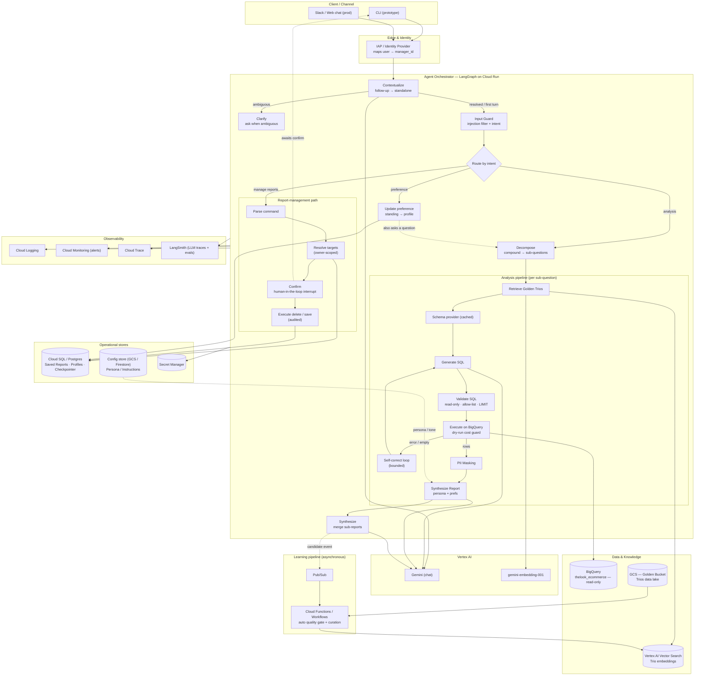
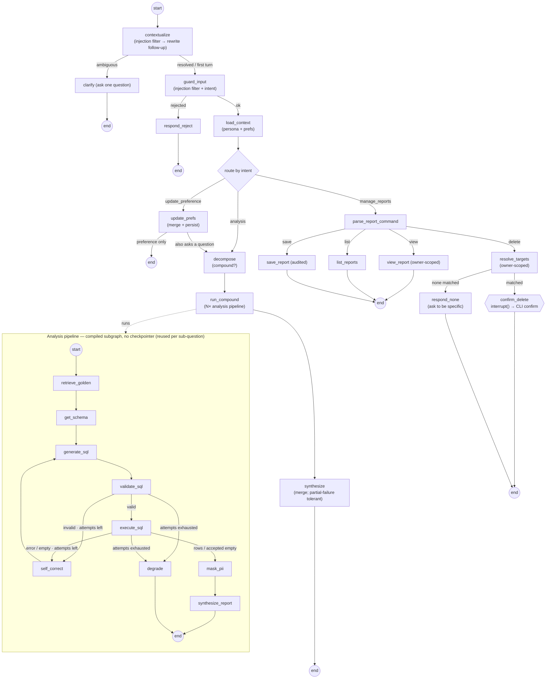
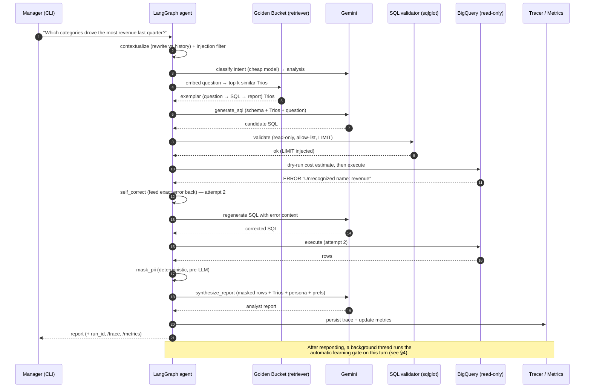
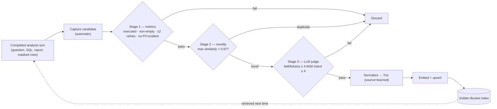
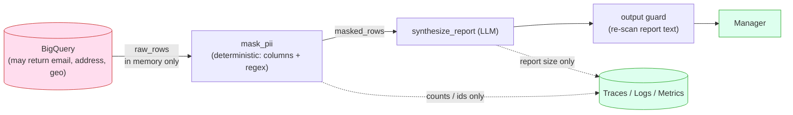

# Architecture & Diagrams

This document is **Deliverable 1** — the architecture diagrams (building blocks, services, and flow)
with a short rationale for every named framework, service, and data store. The deep technical
explanation lives in **[HLD.md](HLD.md)**; the runnable prototype is described in the
**[README](../README.md)**.

The system is designed **production-first** and then realized as a faithful local prototype: the
LangGraph control flow and the trust boundaries are identical in both; only the backing stores differ
(managed GCP services in production, in-process / SQLite / local-file equivalents in the prototype).
That mapping is explicit in [§6](#6-prototype--production-mapping).

---

## 1. Production system architecture

The headline diagram. A thin client talks to a stateful **LangGraph** agent on **Cloud Run**, grounded by
two knowledge sources — the **BigQuery** warehouse (facts) and the **Golden Bucket** of analyst Trios
(interpretation) — and wrapped in cross-cutting layers for safety, memory/persona, resilience, and
observability. Every external box is a named, justified service ([§5](#5-why-each-service-the-rationale)).

**How to read it:** solid arrows are the request/response path within a turn; dotted arrows are
asynchronous or human-in-the-loop edges (the confirmation pause, and the *fully automatic* learning loop
that runs after the answer is returned). The learning loop is deliberately **off the request path** so it
never adds user-facing latency.

---

## 2. The agent graph (LangGraph topology — as built)

This is the **actual** control flow compiled by `build_graph()` in
[`src/assistant/agent/graph.py`](../src/assistant/agent/graph.py). The agent is two compiled graphs: a
**checkpointed outer graph** (conversation, routing, oversight) and a **stateless inner analysis
pipeline** that `run_compound` invokes once per sub-question (a single question is just the degenerate
"one sub-question" case). Routing is implemented as conditional-edge functions, and the safety/PII
boundaries are wired as topology — not as prompt instructions.

Key properties visible here (full discussion in [HLD §4](HLD.md#4-data-flow-between-components)):

- **`mask_pii` is the only edge** from `execute_sql` to `synthesize_report` — the report LLM physically
  cannot receive unmasked rows.
- **The self-correction loop is a graph loop**, bounded by `MAX_SQL_ATTEMPTS` (default 3), not prompt
  recursion — so every attempt is an inspectable, metered state transition.
- **`confirm_delete` is a LangGraph `interrupt()`** — the pause is durable graph state, resumable on the
  same thread.
- **The learning loop is *not* a node.** It runs after the turn responds, on a background thread in the
  CLI (Pub/Sub + Cloud Functions in production). See [§4](#4-the-automatic-learning-loop).

---

## 3. Data flow — the analysis happy path (with self-correction)

A single conversational turn, end to end, including a self-correction round-trip.

---

## 4. The automatic learning loop

Every completed analysis turn becomes a **candidate Trio** and is run through a fully automatic,
three-stage gate — **no user feedback, no manual trigger, no human in the loop**. It runs in the
background so it never adds latency, and stages are ordered cheapest-and-most-decisive-first so the
expensive LLM judge only ever sees novel, already-successful turns.

Promotions are **reversible by id** (delete the `learned_*.json`); the index self-heals via a content
fingerprint. Detail and thresholds: [HLD §8, Requirement 4](HLD.md#requirement-4--continuous-improvement-the-learning-loop).

---

## 5. Why each service (the rationale)

Per the brief: every named framework / service / store, with the reason it was chosen.

| Building block | Service (production) | Why this one |
|---|---|---|
| **Orchestration** | **LangGraph** (+ LangChain Core) | The workflow is a graph with a **loop** (self-correction) and a **pause** (confirmation). LangGraph models loops, conditional routing, and **human-in-the-loop `interrupt()`** as first-class concepts, and its **checkpointer** gives durable, resumable conversation state. The brief also prefers LangGraph/LangChain. |
| **Compute** | **Cloud Run** | Stateless, autoscaling, scale-to-zero container host; durable state lives in Cloud SQL, so the agent tier scales horizontally and cheaply. |
| **LLM** | **Gemini** via **Vertex AI** | Recommended by the brief; strong SQL/reasoning; the **same key/identity provides embeddings**. Vertex gives IAM-based auth (no raw API keys), higher quotas, and data-residency controls. Two-tier routing (a cheap model for low-stakes structured calls, the main model for SQL/report generation) cuts cost and spreads rate-limit load. |
| **Embeddings** | **`gemini-embedding-001`** | One provider for chat + embeddings; 3072-dim vectors; co-located with the model and warehouse. |
| **Warehouse** | **BigQuery** (read-only) | Mandated; the public `thelook_ecommerce` dataset is rich enough for every expected capability. Read-only is enforced at the **IAM** layer (prod) *and* the **SQL-validation** layer (always). A **dry-run byte estimate + max-bytes cap** prevents runaway cost. |
| **Golden Bucket lake** | **GCS** | Cheap, durable object store — the literal "data lake" of analyst Trios; the source of truth that the vector index is built from. |
| **Vector index** | **Vertex AI Vector Search** | Managed ANN at scale, co-located with the model/embeddings. The prototype's in-process cosine store sits behind the same retriever interface, so the swap is mechanical. |
| **Operational stores** | **Cloud SQL (Postgres)** | Transactional deletes (oversight), per-user ownership, and durable conversation state (it also backs the **LangGraph Postgres checkpointer**) in one managed, transactional store. |
| **Persona / config** | **GCS / Firestore** | Tone/instructions are **config, not code**, so a non-developer (the CEO) edits them weekly with versioning + rollback and **no redeploy**. |
| **Secrets** | **Secret Manager** | No secrets in images, code, or env files in production. |
| **Observability** | **Cloud Logging / Monitoring / Trace** + **LangSmith** | The same signals we'd alert on, plus a hosted LLM-trace/eval surface. The prototype emits the *same* run-correlated signals to file-based sinks. |
| **Learning pipeline** | **Pub/Sub + Cloud Functions / Workflows** | Decouples candidate capture from the (idempotent, retryable) quality-gate + curation job, so promotion scales independently and never touches the request path. |

**RAG over fine-tuning** is the other defining choice: analyst knowledge changes continuously, so
retrieval lets us change behavior by *adding a Trio* — no retraining, and full traceability of *why* an
answer was shaped a certain way. Reasoning in depth: [HLD §3](HLD.md#3-reasoning-for-the-chosen-cloud-llm-and-frameworks).

---

## 6. Prototype ↔ production mapping

The prototype keeps the **same graph and the same trust boundaries**; only the backing stores change.
This is itself the extensibility story — each swap happens behind one factory (`from_settings` / `create`).

| Concern | Prototype (this repo) | Production |
|---|---|---|
| Orchestration | LangGraph + LangChain Core (in-process) | Same, on Cloud Run |
| LLM | Gemini via `langchain-google-genai` (API key) | Gemini via Vertex AI (IAM) |
| Embeddings | `gemini-embedding-001` | Same (Vertex AI) |
| Vector store | In-process NumPy cosine (cached to disk) | Vertex AI Vector Search |
| Warehouse | BigQuery via ADC | BigQuery via workload identity, read-only IAM |
| Golden Bucket lake | `data/golden_trios/*.json` | GCS bucket |
| Saved Reports · profiles · checkpointer | SQLite (`data/app.db`) + `InMemorySaver` | Cloud SQL (Postgres) + Postgres checkpointer |
| Persona config | `data/personas/*.yaml` (hot-reload on edit) | GCS / Firestore |
| Secrets | `.env` | Secret Manager |
| Observability | JSON logs + per-turn trace files + `/metrics` summary | Cloud Logging / Monitoring / Trace + LangSmith |
| Learning pipeline | Inline capture + background-thread promotion | Pub/Sub + Cloud Functions / Workflows (same gate) |

---

## 7. The PII trust boundary

The single most important safety property, drawn explicitly. PII is removed **before** any row reaches
the LLM or the user — it is *impossible-by-construction*, not discouraged-by-prompt. Observability never
re-introduces it: **no row data — raw *or* masked — is persisted to traces, logs, or metrics**; only
counts, ids, SQL text, and sizes are recorded (the per-node whitelist in `summarize_delta` drops both
`raw_rows` and `masked_rows`).

The output guard is the *alarm*, not the guarantee: a non-zero `pii_leak_prevented` count means a bug to
fix, even though the user was still protected. Mechanics: [HLD, Requirement 2](HLD.md#requirement-2--safety--pii-masking).
